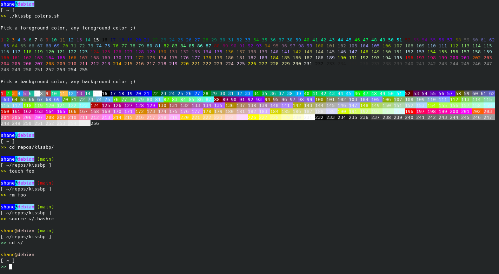

  

# kissbp
(Keep it Simple Stupid Bash Prompt Styler)

---

### __about__  
A simple stupid bash prompt styler i wrote for fun.

### __testing__

Only tested on the following terminals...

* KUbuntu Konsole
* Ubuntu Default Terminal
* Kitty

### __howto__

Requirements

* Must have jq installed (e.g. `sudo apt install jq`)
* Must be running terminal supporting 256 color

Setup

1. Run "kissbp_colors.sh" script to find color id of interest for the foreground and background. (Tip) Choose 0 if you don't want a background color.
2. Open up config file "kissbp.json" and add your color id(s) from step above. Change anything else you want at this time.
3. Stuff `kissbp.json` in your home directory
4. Stuff `kissbp.sh` in your home directory
5. At the end of your ".bashrc" source the `kissbp.sh` script
      e.g.
      `source $HOME/kissbp.sh` 
5. Reopen a new shell or from the current shell just type `source ~/.bashrc`

### __a few more details__  

Here's alittle info to get you started that explains a few simple configuration options in the "kissbp.json"

* __kissbp_bpprompt_fg_color__ - foreground color of `kissbp_bpprompt_sym_look` setting  
* __kissbp_bpprompt_bg_color__ - background color of `kissbp_bpprompt_sym_look` setting  
* __kissbp_bpprompt_sym_look__ - the symbol you can set for your prompt (e.g. `$`, `>>`, `>`)  
* __kissbp_userhost_sep_look__ - the symbol you might want to seperate your username and hostname (e.g. `@`)  
* __kissbp_disable_blinking__ - if enabled it will highlight certain directories (right now `/` and `/mnt`). it will also blink a git branch (see next setting) if your working tree is dirty.    
* __kissbp_blinking_branch__ - the name of the branch to blink on  
* the rest you can probably figure out ;) after all it is a simple stupid styler
