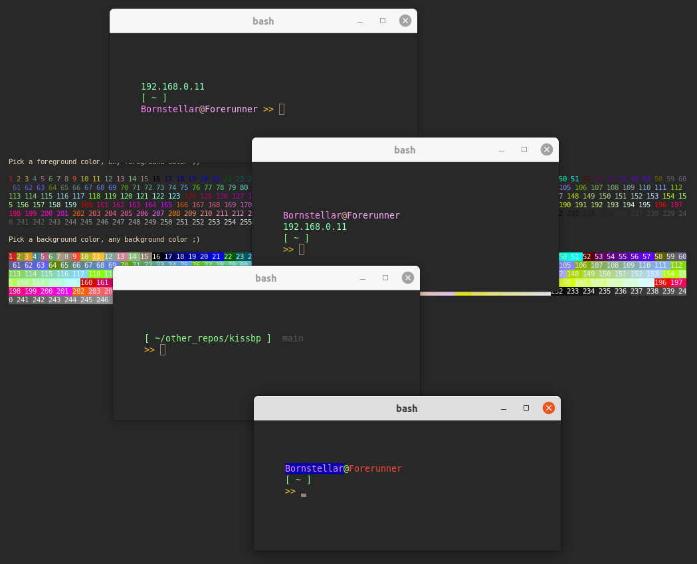

  

# kissbp
(Keep it Simple Stupid Bash Prompt Styler)

---

### __about...__  
A simple stupid bash prompt styler with minimal features but can easily support more. Tested in Konsole, Kitty, and Ubuntu Terminal. Blinking support may not be supported by certain emulators (e.g. Kitty).

### __howto...__

Requirements

* Must have jq installed (e.g. `sudo apt install jq`)
* Must be running terminal supporting 256 color

Setup

1. Run `kissbp_colors.sh` to choose foreground/background colors
2. Edit `kissbp.json` with colors above and/or change to desired settings
3. Stuff `kissbp.json`, `kissbp.sh` and `kissbp_colors.sh` in your home directory
4. At bottom of `.bashrc` source the `kissbp.sh` script like such...  
      `source $HOME/kissbp.sh`  
5. Reopen a new shell to apply settings or just type `source ~/.bashrc`

### __settings...__  

Colors
* __..._fg_color__ - foreground colors
* __..._bg_color__ - background colors

Symbols
* __...sym_look__ - a simple stupid (ascii) symbol(s) for prompt
* __...sep_look__ - a simple stupid (ascii) symbol(s) to seperate user and hostname

Git
* __...enable_special_branch_blinking__ - enable blinking on a special branch when checked out (blinking may not be supported by certain terminal emulators)
* __...enable_special_branch_formatting__ - enable formatting (set to underline) on a special branch when checked out. Due to blinking not always supported, this feature still accomindates the user if animation is still desired
* __...enable_special_branch_message__ - enable a short message to appear on a special branch when checked out (keep messages short, or consider putting them on their own line)
* __...special_dirty_branch_message__ - the message to display on the special branch when checked out and the git working tree is dirty (uncommitted/untracked files)
* __...special_clean_branch_message__ - the message to display on the special branch when checked out and the git working tree is clean
* __...special_branch_name__ - the name of the special branch (e.g. `master`, `main`, `myfeature`)

Directory Notifications
* __...enable_special_dir_blinking__ - enable blinking when in certain directories and/or subdirectories. Right now this is hardcoded to `/mnt/*` and `/`. User will need to modify `kissbp.sh` if they wish to change this at the moment (blinking may not be supported by certain terminal emulators)
* __...enable_special_dir_formatting__ - enable formatting (set to underline) in certain directories and/or subdirectories. Right now this is hardcoded to `/mnt/*` and `/`. User will need ot modify `kissbp.sh` if they wish to change this at the moment. Due to blinking not always supported, this feature still accomindates the user if animation is still desired

Prompt
Finally we come to the prompt itself. Here is where you add/remove features to/from the prompt. This indention style allows for you to move stuff around and create another line when needed. Adding `\n` or indention characters will break this. Here's some examples...

  
```
# example 1
export PS1="
${KISSBP_USERHOST__PROMPT}
${KISSBP_CURRENTDIR_PROMPT} ${KISSBP_BPPROMPT_PROMPT}"
```

  
```
# example 3
export PS1="
${KISSBP_IPADDR_PROMPT}
${KISSBP_GITBRANCH_PROMPT}
${KISSBP_CURRENTDIR_PROMPT}
${KISSBP_BPPROMPT_PROMPT}"
```

  
```
# example 3
export PS1="
${KISSBP_USERHOST_PROMPT} ${KISSBP_IPADDR_PROMPT} ${KISSBP_DATETIME_PROMPT} ${KISSBP_GITBRANCH_PROMPT}
${KISSBP_CURRENTDIR_PROMPT}
${KISSBP_BPPROMPT_PROMPT}"
```
